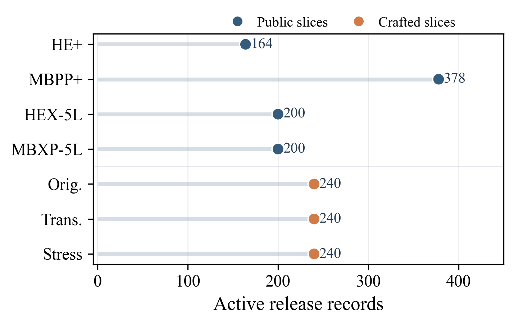

# CodeMarkBench

`CodeMarkBench` is a curated benchmark for evaluating the reliability of source-code watermarking for LLM-based code generation under executable, release-backed conditions. The benchmark contributes seven executed source groups, including three manually reviewed crafted families, plus a unified runtime harness that evaluates four pinned watermarking baselines across five local code generation models.

This repository contains the benchmark definition, execution workflow, release-facing docs, and the materialized tracked summary exports for that benchmark. The publication-facing result of record is the canonical single-host one-shot run on one Linux execution host with eight visible GPUs; the current release surface records `140/140` successful runs with `failed_count = 0`. The identical-execution-class two-host sharded workflow remains available only as an optional reproduction and throughput mode. The frozen release contract is summarized in [`docs/release_contract.md`](docs/release_contract.md).

At a glance:

- benchmark surface: four pinned runtime baselines, five local code generation models, and seven executed benchmark sources
- primary evidence surface: exact-value tables, released submetrics, and failure-oriented summary surfaces
- formal result surface: one canonical single-host 8-GPU release contract, executed through standalone preflight and a direct canonical full rerun
- main finding target: the released tables document reliability gaps in source-code watermarking under reviewer-safe edits, stronger stress attacks, and runtime-deployment constraints

## What Is In Scope

The active runtime baseline implementations used in this release are:

- `stone_runtime`
- `sweet_runtime`
- `ewd_runtime`
- `kgw_runtime`

The paper-facing method labels map directly to these runtime identifiers:

- `STONE` = `stone_runtime`
- `SWEET` = `sweet_runtime`
- `EWD` = `ewd_runtime`
- `KGW` = `kgw_runtime`

The paper-facing comparison surface is canonical-only:

- the main leaderboard keeps the four pinned runtime baselines on the canonical seven-source release suite, while the multilingual sources use the balanced five-language slice
- two white-box source-code watermarking methods are intentionally excluded; see the exclusion note below

The active local model roster is:

- `Qwen/Qwen2.5-Coder-1.5B-Instruct` @ `2e1fd397ee46e1388853d2af2c993145b0f1098a`
- `Qwen/Qwen2.5-Coder-14B-Instruct` @ `aedcc2d42b622764e023cf882b6652e646b95671`
- `Qwen/Qwen2.5-Coder-7B-Instruct` @ `c03e6d358207e414f1eca0bb1891e29f1db0e242`
- `bigcode/starcoder2-7b` @ `bb9afde76d7945da5745592525db122d4d729eb1`
- `deepseek-ai/deepseek-coder-6.7b-instruct` @ `e5d64addd26a6a1db0f9b863abf6ee3141936807`

The public model roster is fixed to those exact `model_name + model_revision` pairs. GitHub carries the canonical benchmark definition, workflow contract, and materialized summary surface; rerun-backed raw artifacts and release metadata preserve the same resolved snapshot revisions. `suite_all_models_methods_export_identity.json` is the machine-readable companion-surface anchor for that pinned release roster.

Some legacy configuration files retain `offline_mock` provider labels for harness compatibility. The release matrix and summary identity bind the actual evaluated local model roster through the `model_name + model_revision` fields above; the `offline_mock` label is not a claim that the formal matrix used mock model outputs.

The active runtime suite executes and scores the following seven atomic source groups:

- `HumanEval+`
- `MBPP+`
- `HumanEval-X (5-language balanced slice)`
- `MBXP-5lang (5-language balanced slice)`
- `Crafted Original`
- `Crafted Translation`
- `Crafted Stress`

Those seven sources intentionally combine:

- four public executable benchmark slices
- three curated crafted benchmark families finalized under manual release review

Benchmark construction and release review are manual, checklist-driven processes in this release. The crafted benchmark families and the public release wording were designed, audited, and finalized under documented release review rather than generated automatically.

`HumanEval-X`, `MBXP-5lang`, and all three crafted sources are executed in the canonical release through the same balanced five-language runtime set: `python`, `cpp`, `java`, `javascript`, and `go`.

## Excluded White-Box Methods

Two white-box source-code watermarking methods for LLM-based code generation are intentionally excluded from the active benchmark:

- `CodeIP`: the public code exists, but the official public artifact set is incomplete, so it cannot be used as an official-public, runtime-comparable, reproducible benchmark lane
- `Practical and Effective Code Watermarking for Large Language Models`: the official implementation follows a training/model-modifying path rather than the shared runtime-generation contract used here

`UIUC ICLR 2025 / llm-code-watermark` remains cited as a prior robustness study rather than a redundant benchmark replacement.

The reviewer-facing screening note for included and excluded methods lives in [`docs/baseline_screening.md`](docs/baseline_screening.md).

## Canonical Release Suite

The canonical release suite keeps the benchmark structure intact with deterministic release-slice counts:

- `HumanEval+`: `164`
- `MBPP+`: `378`
- `HumanEval-X (5-language balanced slice)`: `200`
- `MBXP-5lang (5-language balanced slice)`: `200`
- `Crafted Original`: `240`
- `Crafted Translation`: `240`
- `Crafted Stress`: `240`

The canonical public execution inputs are deterministic, versioned release files stored under [`data/release/sources/`](data/release/sources). `data/interim/` is reserved for build-time or diagnostic intermediates and is not part of the active public workflow.

The canonical benchmark-definition table for the current release lives under [`results/tables/dataset_statistics/benchmark_definition_summary.csv`](results/tables/dataset_statistics/benchmark_definition_summary.csv) and [`results/tables/dataset_statistics/benchmark_definition_summary.json`](results/tables/dataset_statistics/benchmark_definition_summary.json).



## Repository Layout

- `codemarkbench/`: orchestration, adapters, scoring, reporting, and benchmark logic
- `configs/`: active baseline configs, suite manifests, and utility configs
- `data/release/sources/`: canonical executed release-suite inputs for all seven sources
- `docs/`: public documentation, formulas, datasets, artifacts, and reproduction guides
- `results/figures/`: dataset statistics figures plus materialized repository-tracked full-run summary figures
- `results/tables/`: dataset statistics tables plus materialized repository-tracked full-run summary tables
- `scripts/`: data preparation, manifest building, audits, figure export, packaging, and helper entrypoints
- `third_party/`: pinned upstream provenance manifests for the four canonical baselines and their public provenance notes

## Scoring

Every final report carries a `summary.scorecard` block. The public contract includes the released component scores, strict/raw diagnostics, conditioning terms, stability diagnostics, availability axes, and the final headline score:

- `detection_separability`
- `robustness`
- `raw_robustness_strict`
- `robustness_status`
- `robustness_support_rate`
- `stress_robustness`
- `utility`
- `raw_utility_strict`
- `utility_status`
- `utility_support_rate`
- `stealth`
- `efficiency`
- `gate`
- `core_score`
- `raw_core_score_strict`
- `headline_core_score`
- `generalization`
- `raw_generalization_strict`
- `headline_generalization`
- `generalization_status`
- `CodeMarkScore`
- `source_stability`
- `task_stability`
- `language_stability`
- `cross_family_transfer`
- `scale_consistency`
- `scale_supported_families`
- `scale_supported_family_count`
- `generalization_supported`
- `generalization_available_axes`
- `score_coverage`
- `stealth_conditioned`
- `efficiency_conditioned`
- `raw_composite_strict`
- `score_version`

Within that public contract, `efficiency` and `efficiency_conditioned` refer only to token-normalized clean-vs-watermarked generation overhead. Queue wait, detached-launch latency, and shared-pool scheduler delay remain descriptive timing surfaces and are not part of the headline efficiency semantics.

The scorecard also exposes supporting public diagnostics such as `negative_control_fpr`, `negative_control_support_rate`, `negative_vs_watermarked_auroc`, `watermarked_pass_preservation`, `attacked_pass_preservation`, `semantic_validation_rate`, `declared_semantic_validation_rate`, `runtime_semantic_validation_rate`, `declared_semantic_validation_language_rate`, `runtime_semantic_validation_language_rate`, `runtime_validation_basis`, and `runtime_validation_annotations_available`.

For generalization, the released diagnostics and the availability tokens use the same documented axis names:

- `source_stability`
- `task_stability`
- `language_stability`
- `cross_family_transfer`

[`docs/metrics.md`](docs/metrics.md) defines the narrative public scoring contract. [`results/schema.json`](results/schema.json) documents the per-run machine-readable report serialization, while [`results/export_schema.json`](results/export_schema.json) documents the tracked `suite_all_models_methods` summary-export contract. [`docs/release_provenance.md`](docs/release_provenance.md) records the publication-facing canonical matrix identity, assembly provenance, and release-surface contract.

`CodeMarkScore` is a secondary summary metric, not a replacement for the submetrics or exact-value tables. The release-facing scorecard intentionally separates strict/raw diagnostics from public summary scalars. Public `robustness` is computed from the reviewer-safe core attack tier only; stress attacks are exported separately through `stress_robustness` and table-first breakdowns. Public `utility` and `generalization` are support-aware summaries, while `raw_robustness_strict`, `raw_utility_strict`, `raw_core_score_strict`, `raw_generalization_strict`, and `raw_composite_strict` preserve coverage-explicit diagnostic views; unsupported top-level strict generalization and the strict composite remain fail-closed.

The released results should be read as failure-revealing benchmark evidence: current methods can retain nontrivial detection and utility while still exposing limited robustness under reviewer-safe transformations. Some frozen crafted-source prompt strings still contain the legacy phrase `expert-constructed` because they are part of the executed result-of-record input text. That phrase is not an external expert-panel credential claim; the crafted slices should be described as project-authored, template-assisted, manually reviewed curated benchmark content. [`docs/result_interpretation.md`](docs/result_interpretation.md) gives the reviewer-facing guide for reading low robustness values, strict zero diagnostics, constant support fields, and table-first evidence without mistaking them for failed runs.

The public headline score is:

\[
\mathrm{CodeMarkScore}=\mathrm{Gate}\cdot \mathrm{GM}\left(\mathrm{HeadlineCore}, \mathrm{HeadlineGeneralization}\right)
\]

with `CodeMarkScore in [0,1]`.

`core_score` remains the released unsmoothed public core diagnostic, and raw `generalization` remains separately exported when stability axes are actually available. The headline layer applies the same public soft floor (`eps = 0.05`) to every public core pillar and uses a neutral `headline_generalization = 0.5` when `generalization_status = unsupported`; in that unsupported case the raw `generalization` field is released as `null`/N.A. rather than a misleading `1.0`. Reviewers should interpret the headline together with `gate`, `core_score`, `headline_core_score`, `generalization`, `headline_generalization`, `generalization_status`, strict/raw diagnostics, and the exported decomposition tables rather than treating the headline as the only result surface.

For release-facing tables and decomposition sidecars, `score_semantics` makes the aggregation contract explicit. Rows tagged `scorecard_recomputed_from_grouped_benchmark_rows` are fresh scorecard evaluations over grouped slices; rows tagged `descriptive_mean_of_model_method_scorecard_rollups` are descriptive means over already-exported model-method rows; decomposition payloads tagged `multiplicative_headline_component_decomposition` restate the published headline components and raw diagnostics without inventing a second scoring rule. When `generalization_status = unsupported`, the raw `generalization` value is exported as `null`/N.A. for unavailable axes rather than evidence of perfect transfer. In descriptive rollups such as `model_summary.*`, a mixed method set can export `generalization_status = descriptive_mixed`; that marker means the row averages already-exported method-level scorecards and must not be read as a fresh grouped generalization verdict. In the tracked score-decomposition figure, `Headline Gen` uses `//` for `unsupported -> neutral 0.50 headline value` and `xx` for `supported_zero -> 0.05 headline floor`.

The released model-generalization surface is intentionally split in two:

- `cross-family transfer` enters the `HeadlineGeneralization` multiplier
- `within-family scale consistency` is released as a diagnostic submetric only

This keeps the current `Qwen` scale ladder visible without letting one family receive disproportionate headline-score influence merely because it contributes more scales in this release.

The exact formulas are documented in [`docs/metrics.md`](docs/metrics.md).

## Public Results And Artifacts

This companion repository ships:

- code
- canonical benchmark inputs
- dataset statistics figures and tables
- documentation and reproduction scripts
- materialized repository-tracked full-run summary exports and regeneration scripts

The repository does **not** store the rerun-backed raw `140`-run full-suite tree in git. Large raw full-run outputs are distributed outside git through the Zenodo artifact path described in [`docs/artifacts.md`](docs/artifacts.md).

The publication-facing result-of-record contract is the formal single-host `suite_all_models_methods` run on one Linux execution host with `CUDA_VISIBLE_DEVICES=0,1,2,3,4,5,6,7`. The current canonical matrix reports `run_count = 140`, `success_count = 140`, `failed_count = 0`, and `execution_mode = single_host_canonical`. GitHub is the lightweight companion surface for code, docs, canonical inputs, environment capture, and tracked summary exports; Zenodo carries the rerun-backed raw matrix tree and sanitized release bundle.

The corrected archival Zenodo record for the raw result artifact and sanitized release bundle is [`10.5281/zenodo.19740954`](https://doi.org/10.5281/zenodo.19740954). If a reviewer wants to rebuild exactly the archived sanitized bundle rather than inspect the latest companion branch, use the GitHub commit recorded in the Zenodo manifest. For this deposited bundle, the byte-identical source commit is `3252ca48e15416eee5259967aa735c969f7eb150`:

```bash
git checkout 3252ca48e15416eee5259967aa735c969f7eb150
```

Later `main` commits may contain documentation, validation, or companion-surface publication updates; result claims should follow the matrix identity and Zenodo artifact checksums. Use current GitHub `main` for the latest reviewer-facing companion tables and checks, and use the archived commit above only for byte-identical restoration of the deposited sanitized bundle.

- dataset statistics figures live under [`results/figures/dataset_statistics`](results/figures/dataset_statistics)
- dataset statistics tables live under [`results/tables/dataset_statistics`](results/tables/dataset_statistics)
- materialized full-run summary figures live under [`results/figures/suite_all_models_methods`](results/figures/suite_all_models_methods)
- materialized full-run summary tables live under [`results/tables/suite_all_models_methods`](results/tables/suite_all_models_methods)
- the paper exact-value tables use the filenames [`suite_all_models_methods_method_master_leaderboard.*`](results/tables/suite_all_models_methods), [`suite_all_models_methods_method_model_leaderboard.*`](results/tables/suite_all_models_methods), and [`suite_all_models_methods_model_method_functional_quality.*`](results/tables/suite_all_models_methods)
- the release interpretation guide lives in [`docs/result_interpretation.md`](docs/result_interpretation.md), including the method-level leaderboard, expected zero/constant diagnostics, and the robustness-gap reading
- descriptive timing artifacts are exported under [`suite_all_models_methods_model_method_timing.*`](results/tables/suite_all_models_methods) for repo and supplement use
- the paper-facing figure surface is intentionally narrow: score decomposition, detection-vs-utility, release-slice composition, and one conceptual evaluation-overview panel, while exact-value leaderboard and breakdown evidence stays table-first
- those summary outputs can be regenerated from the external raw artifact, or from a local rerun of the same canonical `configs/matrices/suite_all_models_methods.json` / `suite_all_models_methods` manifest-profile pair with the same official runtime roster and pinned model revisions; custom reruns must write to custom output paths instead of reusing the canonical `suite_all_models_methods` release surface
- raw full-run artifacts are documented in [`docs/artifacts.md`](docs/artifacts.md)
- citation metadata lives in [`CITATION.cff`](CITATION.cff) and [`docs/citation.md`](docs/citation.md)
- third-party baseline redistribution boundaries are summarized in [`THIRD_PARTY_NOTICES.md`](THIRD_PARTY_NOTICES.md)
- the rerun-backed public packet also discloses the exact model identifiers, resolved model snapshot revisions, environment-of-record capture, and baseline provenance used for the published run
- the formal Linux package snapshot is tracked at [`results/environment/release_pip_freeze.txt`](results/environment/release_pip_freeze.txt) for reviewer audit of the resolved release environment
- release limitations and validity boundaries are summarized in [`docs/threats_to_validity.md`](docs/threats_to_validity.md)
- revision or follow-up experiment workflow notes live in [`docs/revision_experiments.md`](docs/revision_experiments.md)

Use [`docs/reproduce.md`](docs/reproduce.md) for the canonical three-level reviewer path, and [`docs/reproducibility.md`](docs/reproducibility.md) for the fresh-cloud recovery path after the original execution server is no longer available:

1. browse the repository-tracked dataset statistics, docs, and materialized full-run summary exports
2. regenerate full-run summaries from the external raw artifact
3. rerun the canonical release suite on a GPU host

The first two levels are independent of the original execution server after the
GitHub repository and Zenodo record are available. A fresh Level 3 rerun still
depends on external availability of the pinned Hugging Face model snapshots and
the pinned upstream baseline repositories; use
[`constraints-release-cu124.txt`](constraints-release-cu124.txt) as an
additional requirements file to anchor the recorded CUDA 12.4 Python package
versions.

For a fresh reviewer clone, the shortest non-GPU path is:

```bash
git clone https://github.com/Haoyi-Zhang/CodeMarkBench.git
cd CodeMarkBench
python -m venv .venv
source .venv/bin/activate
python -m pip install -r requirements.txt
python scripts/verify_release_integrity.py
python scripts/reviewer_workflow.py browse --summary-only
```

The Zenodo raw matrix is needed only for Level 2 regeneration. Download and
verify it with `SHA256SUMS.txt` as shown in [`docs/reproduce.md`](docs/reproduce.md)
and [`docs/artifacts.md`](docs/artifacts.md), then extract it from the repository
root so that `results/matrix/suite_all_models_methods/matrix_index.json` exists.

Level 1 is the default reviewer path. Level 2 is the artifact-backed regeneration path described in [`docs/artifacts.md`](docs/artifacts.md). If you already have rerun-backed summary JSON/tables but not the raw matrix tree, use the redraw-only path in [`docs/reproduce.md`](docs/reproduce.md) instead of `regenerate`.

## Reviewer Quick Start

The reviewer workflow exposes these entrypoints. Start with `browse` in a fresh clone; it does not require the raw matrix artifact:

```bash
python scripts/reviewer_workflow.py browse
python scripts/reviewer_workflow.py subset --models Qwen/Qwen2.5-Coder-14B-Instruct --methods sweet_runtime --sources crafted_original
python scripts/reviewer_workflow.py subset --profile reviewer_subset_all_sources --models Qwen/Qwen2.5-Coder-14B-Instruct --methods sweet_runtime
python scripts/reviewer_workflow.py subset --models Qwen/Qwen2.5-Coder-7B-Instruct --methods kgw_runtime --sources humaneval_plus --limit 8
CUDA_VISIBLE_DEVICES=0,1,2,3,4,5,6,7 python scripts/reviewer_workflow.py full
bash scripts/remote/run_reviewer_subset_pair.sh
```

Run `regenerate` only after restoring the Zenodo raw artifact so that `results/matrix/suite_all_models_methods/matrix_index.json` exists:

```bash
python scripts/reviewer_workflow.py regenerate --matrix-index results/matrix/suite_all_models_methods/matrix_index.json --figure-dir results/figures/suite_all_models_methods --table-dir results/tables/suite_all_models_methods
```

Shell-native wrappers expose the same flows:

```bash
bash scripts/reviewer_workflow.sh browse
bash scripts/reviewer_workflow.sh subset --models Qwen/Qwen2.5-Coder-14B-Instruct --methods sweet_runtime --sources crafted_original
PYTHON_BIN=/path/to/tosem_release_env/bin/python bash scripts/reviewer_workflow.sh subset --models Qwen/Qwen2.5-Coder-7B-Instruct --methods kgw_runtime --sources humaneval_plus --limit 8
CUDA_VISIBLE_DEVICES=0,1,2,3,4,5,6,7 bash scripts/reviewer_workflow.sh full
powershell -ExecutionPolicy Bypass -File scripts/reviewer_workflow.ps1 browse
powershell -ExecutionPolicy Bypass -File scripts/reviewer_workflow.ps1 subset --models Qwen/Qwen2.5-Coder-14B-Instruct --methods sweet_runtime --sources crafted_original
```

Bare `regenerate` commands target the canonical `configs/matrices/suite_all_models_methods.json` / `suite_all_models_methods` rerun-backed matrix index and its tracked `suite_all_models_methods` figure/table surface. Custom matrices must pass custom output directories and should not reuse the canonical release paths.

- `browse` is always safe in the current companion-repository checkout
- `regenerate` is the canonical full-suite summary refresh path; it expects the canonical rerun-backed matrix tree rather than an arbitrary unrelated matrix
- `subset` now performs manifest build, benchmark audit, matrix audit, and environment capture before execution
- the shell and PowerShell wrappers resolve `--python` first, then `PYTHON_BIN`, then a repo-local `.venv`; if neither is available they accept an already-active dedicated virtualenv/current interpreter under `.venv` or `tosem_release*`, and otherwise fail fast with a clear interpreter error
- `subset` prints the manifest path, matrix index path, run-output root, workflow log, per-run log/report globs, and a ready-to-copy `monitor_matrix.py` command before launching the matrix runner
- `subset` accepts `--benchmark-source` as a reviewer-facing alias for `--sources`
- `subset --no-run` is a build-only path that writes the subset manifest without environment capture or matrix launch
- append `--limit <n>` when you want a true micro-smoke for one model, one watermark, and one source instead of the full selected source-group slice
- for a single-model or reviewer subset rerun, you can also reuse `make matrix-monitor MATRIX_INDEX=<printed matrix index path>` after the workflow prints the subset artifacts
- repeated reviewer subsets should use distinct `--profile` values whenever you want isolated manifests, locks, environment captures, and output roots
- `full` is the formal Linux-only 8-GPU helper; it must be launched under `CUDA_VISIBLE_DEVICES=0,1,2,3,4,5,6,7`, and there is no PowerShell `full` path for the canonical single-host rerun
- the canonical parallel reviewer gate uses `suite_reviewer_subset_a` and `suite_reviewer_subset_b`; `bash scripts/remote/run_reviewer_subset_pair.sh` reserves those profiles so subset A/B do not share a `.matrix_runner.lock`
- local `subset` and `full` default to cache-backed readiness checks; add `--probe-hf-access` when you want the readiness gate to verify token-backed Hugging Face access too
- `subset` defaults to fail-fast
- `full` is the formal single-host full-suite helper; it wraps standalone preflight plus a direct canonical full launch, and its scheduler contract is fixed to `--gpu-slots 8 --gpu-pool-mode shared --cpu-workers 9 --retry-count 1 --command-timeout-seconds 259200`
- the identical-execution-class sharded path documented below remains available only as an optional two-host reviewer-safe reproduction or throughput mode
- the dataset review checkpoint is centered on `benchmark_definition_summary.csv`, `release_slice_language_breakdown.csv`, `dataset_task_category_breakdown.csv`, `dataset_family_breakdown.csv`, `release_source_manifest_index.csv`, `release_slice_composition.png`, and `evaluation_dimensions_overview.png`

## Linux GPU Rerun Quick Start

Full reruns belong in [`docs/remote_linux_gpu.md`](docs/remote_linux_gpu.md). The formal public rerun path is the single-host 8-GPU workflow:

```bash
python -m pip install --extra-index-url https://download.pytorch.org/whl/cu124 \
  -r requirements.txt -r requirements-remote.txt -r constraints-release-cu124.txt
bash scripts/fetch_runtime_upstreams.sh all
python scripts/build_suite_manifests.py
make suite-validate
python scripts/audit_full_matrix.py --manifest configs/matrices/suite_all_models_methods.json --profile suite_all_models_methods --strict-hf-cache --model-load-smoke --runtime-smoke --skip-provider-credentials
python scripts/audit_benchmarks.py --profile suite
CUDA_VISIBLE_DEVICES=0,1,2,3,4,5,6,7 bash scripts/remote/run_preflight.sh --formal-full-only
CUDA_VISIBLE_DEVICES=0,1,2,3,4,5,6,7 bash scripts/remote/run_formal_single_host_full.sh --command-timeout-seconds 259200
```

`make suite-validate` only validates config and manifest structure. The authoritative rerun-readiness gate is `scripts/audit_full_matrix.py` with `--strict-hf-cache --model-load-smoke --runtime-smoke`, including the evaluator-side offline load required by the canonical baseline-eval contract, or the A/B-free remote path in [`scripts/remote/run_preflight.sh`](scripts/remote/run_preflight.sh). For the formal release path, use [`scripts/remote/run_formal_single_host_full.sh`](scripts/remote/run_formal_single_host_full.sh); the older `run_suite_matrix.sh --run-full` wrapper remains engineering smoke only. For local reviewer runs that should stay cache-only, use `python scripts/reviewer_workflow.py subset ...` without `--probe-hf-access` after the local caches and upstream checkouts are already available. For `regenerate`, canonical `suite_all_models_methods` figure/table paths are reserved for the canonical full-suite matrix index; custom matrices must use custom output directories.
If you explicitly need the optional reviewer-safe two-host reproduction / throughput path, the repository also supports identical-execution-class sharding. That path does not change the public benchmark contract; it keeps each run on one host and can produce an inspection-only merged matrix index after strict merge validation, but the publication result of record remains the single-host canonical matrix. See [`docs/remote_linux_gpu.md`](docs/remote_linux_gpu.md) for the exact constraints and merge workflow.

The canonical suite manifests should report:

- `suite_all_models_methods = 140`
- `suite_canary_heavy = 28`
- `model_invocation_smoke = 112`

Use [`docs/remote_linux_gpu.md`](docs/remote_linux_gpu.md) for the full clean-output, monitoring, figure/table export, and release workflow. Reviewers who only need the shipped summary assets should stop at Level 1 in [`docs/reproduce.md`](docs/reproduce.md); they do not need to rerun models.
Use [`scripts/verify_release_integrity.py`](scripts/verify_release_integrity.py) as a lightweight fresh-clone check for the canonical manifest digest, summary hashes, run inventory, source counts, and token-marker scan.

## Optional Two-Host Sharded Reproduction / Throughput Mode

The benchmark contract remains the canonical `suite_all_models_methods` suite. The optional reviewer-safe two-host path keeps each canonical run entirely on one host and can yield an inspection-only merged matrix index after strict merge validation, but it does not redefine the published single-host result of record.

This optional two-host path is operationally acceptable only when both hosts share:

- the same frozen repository snapshot
- the same software image and venv path
- the same `model_name + model_revision` roster
- the same canonical-model cache readiness contract
- the same GPU class and driver stack

The documented reviewer-safe two-host example uses:

- `A800-SXM4-40GB x8`
- `96` CPU cores
- `240 GB` RAM
- `2 TB` data disk

Use the data disk, not the `50 GB` system disk, for the repository, `results/`, and `model_cache/`.

The optional two-host sharded workflow is:

```bash
python scripts/build_matrix_shards.py --manifest configs/matrices/suite_all_models_methods.json --profile suite_all_models_methods --shards 2
# host 1 readiness
CUDA_VISIBLE_DEVICES=0,1,2,3,4,5,6,7 bash scripts/remote/run_matrix_shard.sh --manifest results/matrix_shards/suite_all_models_methods/suite_all_models_methods_shard_01_of_02.json --profile suite_all_models_methods_shard_01_of_02 --shard-index 1 --shard-count 2 --readiness-only
# host 2 readiness
CUDA_VISIBLE_DEVICES=0,1,2,3,4,5,6,7 bash scripts/remote/run_matrix_shard.sh --manifest results/matrix_shards/suite_all_models_methods/suite_all_models_methods_shard_02_of_02.json --profile suite_all_models_methods_shard_02_of_02 --shard-index 2 --shard-count 2 --readiness-only
# host 1 launch
CUDA_VISIBLE_DEVICES=0,1,2,3,4,5,6,7 bash scripts/remote/run_matrix_shard.sh --manifest results/matrix_shards/suite_all_models_methods/suite_all_models_methods_shard_01_of_02.json --profile suite_all_models_methods_shard_01_of_02 --shard-index 1 --shard-count 2 --skip-readiness --no-clean
# host 2 launch
CUDA_VISIBLE_DEVICES=0,1,2,3,4,5,6,7 bash scripts/remote/run_matrix_shard.sh --manifest results/matrix_shards/suite_all_models_methods/suite_all_models_methods_shard_02_of_02.json --profile suite_all_models_methods_shard_02_of_02 --shard-index 2 --shard-count 2 --skip-readiness --no-clean
python scripts/merge_sharded_matrix.py --manifest configs/matrices/suite_all_models_methods.json --profile suite_all_models_methods --shard-index <shard-1-index> --shard-index <shard-2-index> --host-receipt <shard-1-receipt> --host-receipt <shard-2-receipt>
```

Operationally, run readiness on both hosts first, wait until both shard receipts are `passed`, and only then launch both shards with `--skip-readiness --no-clean` so the real matrix work starts from a matched baseline. Host-local Hugging Face warmup is acceptable so long as both hosts end up with the same pinned `model_name + model_revision` roster and pass the same readiness checks.

The shard-local throughput contract is fixed to:

- `--gpu-slots 8`
- `--gpu-pool-mode shared`
- `--cpu-workers 9`
- `--retry-count 1`
- non-fail-fast

This mode does not change `CodeMarkScore` or headline efficiency semantics because those timing fields come from per-run stage timings, not outer queue wait or cross-host campaign wall-clock. The coordinator may have more physical GPUs than the worker hosts so long as every optional shard host uses the same visible execution class, for example `CUDA_VISIBLE_DEVICES=0,1,2,3,4,5,6,7` on both machines. After merge, keep the merged index in an inspection-only or reviewer-reproduction lane: use it to validate shard completeness and per-run provenance, but do not feed it into the publication-facing regenerate/export path or relabel it as the canonical single-host release surface.

## Reproduction Levels

- [`docs/reproduce.md`](docs/reproduce.md): step-by-step reproduction paths
- [`docs/reproducibility.md`](docs/reproducibility.md): fresh-cloud recovery and rerun checklist
- [`docs/datasets.md`](docs/datasets.md): active-slice dataset rules, canonical release-suite statistics, and curation notes
- [`docs/metrics.md`](docs/metrics.md): mathematical score definitions
- [`docs/baseline_screening.md`](docs/baseline_screening.md): included baseline roster and excluded white-box screening rationale
- [`docs/baselines.md`](docs/baselines.md): pinned upstream baseline provenance and fetch rules
- [`docs/environment.md`](docs/environment.md): exact runtime environment capture and review notes
- [`docs/artifacts.md`](docs/artifacts.md): raw artifact distribution policy
- [`docs/remote_linux_gpu.md`](docs/remote_linux_gpu.md): Linux GPU rerun workflow

## Provenance And Fetch Policy

- model weights are **not** distributed in this repository
- pinned upstream baseline checkouts are **not** vendored here unless redistributable and explicitly packaged
- model weights are pulled from Hugging Face by exact model identifier
- baseline implementations are fetched from pinned upstream repositories using the manifests in [`third_party`](third_party), while orchestration, local model loading, and decoding policy remain benchmark-controlled
- upstream provenance does not imply uniform redistribution permission; license status is tracked per manifest

The canonical release suite assumes reproducible local-model execution and project-native adapters around the pinned upstream baseline logic. API-backed execution is not part of the current public benchmark path.
